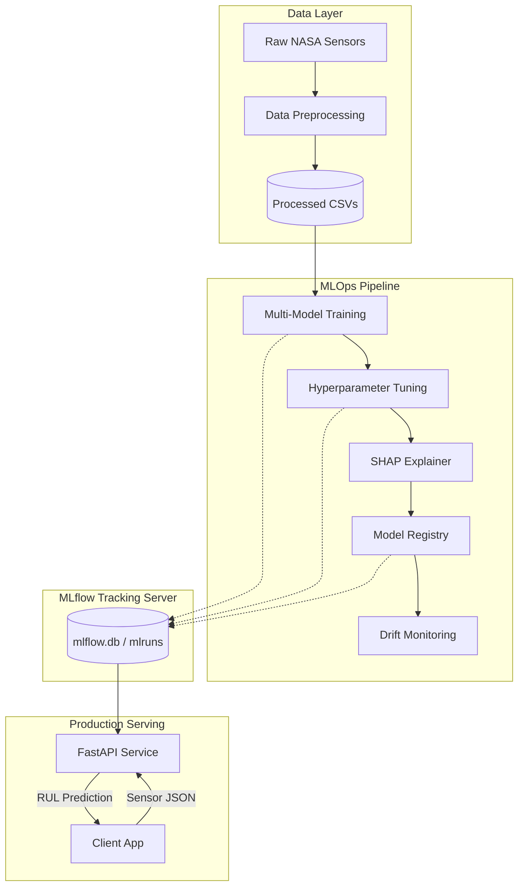
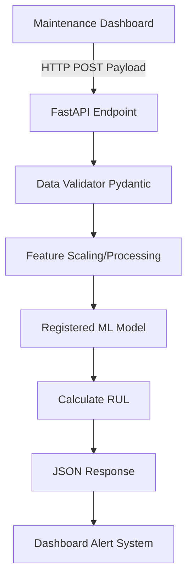
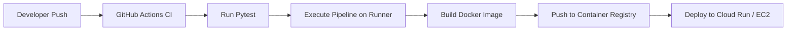

# NASA Turbofan MLOps

<div align="center">
  
  
  
  
  
</div>

---

## 📋 Project Information

### General Information

* **Project Name:** NASA Turbofan MLOps Pipeline (`nasa-turbofan-mlops`)
* **Project Type:** End-to-End Machine Learning Operations (MLOps) / Predictive Maintenance API
* **Project Description:** A fully automated, production-ready MLOps pipeline designed to predict the Remaining Useful Life (RUL) of turbofan engines using run-to-failure sensor data. The project orchestrates data preprocessing, multi-model training, hyperparameter tuning, AI explainability, model registration, drift monitoring, and RESTful model serving.
* **Problem Statement:** Unexpected degradation and failure of critical machinery (such as aircraft engines) lead to catastrophic safety incidents and massive financial losses. Traditional preventative maintenance is highly inefficient—parts are replaced either too early (wasting resources) or too late (causing downtime).
* **Project Objectives:** 
  1. Accurately predict engine RUL based on real-time multi-sensor telemetry.
  2. Automate the entire machine learning lifecycle from raw data to API deployment.
  3. Ensure model transparency through Explainable AI (XAI).
  4. Track all experiments, artifacts, and metrics systematically.
* **Target Users:** Reliability Engineers, MLOps Engineers, Data Scientists, and Aviation Maintenance Teams.

---

## 🛠️ Technical Stack

### Backend & API Serving
* **Runtime Environment:** Python 3.10+
* **Framework:** FastAPI (High-performance asynchronous REST framework) / Uvicorn
* **API Architecture:** RESTful API
* **Authentication System:** API Key-based Authentication (Headers)
* **Validation:** Pydantic (Strict typing and payload validation)
* **Error Handling:** Global exception handlers with structured JSON responses
* **Business Logic Layer:** Modularized Python scripts coordinated by an orchestrator (`run_pipeline.py`)

### Data & Tracking (Database)
* **Database Engine:** SQLite (`mlflow.db`)
* **Tracking System:** MLflow Tracking server
* **Data Models:** MLflow Experiments, Runs, Metrics, Params, and Tags
* **Storage:** Local filesystem for CSV artifacts and serialized models (`.pkl`)

### AI / Machine Learning
* **Problem Type:** Multivariate Time-Series Regression
* **Dataset:** NASA CMAPSS (Commercial Modular Aero-Propulsion System Simulation) Dataset (FD001)
* **Model Architecture:** Ensemble Tree Methods (XGBoost / Random Forest)
* **Data Preprocessing:** Rolling window feature extraction, sensor normalization, RUL target generation.
* **Explainability:** SHAP (SHapley Additive exPlanations) for global and local feature importance.
* **Evaluation Metrics:** RMSE (Root Mean Squared Error), MAE (Mean Absolute Error), R² Score.

### Infrastructure & DevOps
* **Version Control:** Git / GitHub
* **Containerization:** Docker & Docker Compose
* **Experiment Tracking:** MLflow
* **Testing:** Pytest (Data schema validation, pipeline integrity)
* **Environment Management:** `requirements.txt` & YAML Configurations

---

## 📂 Repository Structure

The repository follows a modular, separation-of-concerns architecture designed for enterprise ML projects.

```text
nasa-turbofan-mlops/
├── configs/                  # Centralized configuration management
│   └── config.yaml           # Global parameters (hyperparameters, paths)
├── data/                     # Data lake architecture
│   ├── raw/                  # Immutable original NASA datasets (*.txt)
│   └── processed/            # Cleaned, feature-engineered datasets (*.csv)
├── docs/                     # Project documentation and generated reports
├── outputs/                  # Exported visualizations and drift reports
│   ├── plots/                # SHAP summary plots
│   └── reports/              # HTML data drift reports
├── mlruns/                   # MLflow artifact and metric storage
├── src/                      # Core business and ML logic
│   ├── data_preprocessing.py # Stage 1: Data cleaning & feature engineering
│   ├── train.py              # Stage 2: Multi-model training and evaluation
│   ├── tune.py               # Stage 3: Hyperparameter optimization
│   ├── explain.py            # Stage 4: SHAP model explainability
│   ├── register.py           # Stage 5: MLflow model registry promotion
│   ├── monitor.py            # Stage 6: Data and concept drift monitoring
│   └── serve.py              # FastAPI model serving application
├── tests/                    # Automated testing suite
│   └── test_pipeline.py      # Pytest assertions for data and configs
├── Dockerfile                # Container definition for the API
├── docker-compose.yml        # Multi-container orchestration (API + MLflow)
├── run_pipeline.py           # Master orchestrator script
└── requirements.txt          # Python dependency tree
```

---

## 📖 Project Overview

**NASA Turbofan MLOps** is a comprehensive predictive maintenance solution. 

While many AI projects end at a Jupyter Notebook, this project treats the machine learning model as a dynamic software asset. It implements a fully automated pipeline (`run_pipeline.py`) that ingests raw telemetry data from engines, processes it, trains models, tunes them, explains their behavior, registers the best candidate, and deploys it as a REST API.

By leveraging **MLflow** for tracking and **SHAP** for explainability, the system guarantees reproducibility and trust—critical requirements in the aerospace and heavy machinery industries.

---

## ✨ Features

* ⚙️ **Automated End-to-End Pipeline:** A single master script orchestrates 6 distinct ML stages, terminating pipeline execution safely if any stage fails.
* 📊 **Experiment Tracking & Registry:** Integrates an SQLite-backed MLflow server to log every hyperparameter, metric, and model artifact, preventing knowledge loss.
* 🧠 **Explainable AI (XAI):** Automatically generates SHAP plots to explain *why* the model predicted a specific RUL, opening the "black box" of AI for mechanical engineers.
* 🛡️ **Automated Data Validation:** Uses `pytest` to strictly enforce data schemas, verify the absence of NaNs, and check configuration states before expensive compute begins.
* 📉 **Drift Monitoring:** Analyzes training vs. serving data distributions to detect Data Drift, ensuring the model's predictions remain reliable over time.
* 🚀 **Production REST API:** Wraps the best-registered model in a FastAPI service, allowing real-time RUL predictions via standard HTTP POST requests.

---

## 🏗️ System Architecture

The system is decoupled into two primary architectures: **The Training Pipeline** and **The Serving Infrastructure**.



---

## 🔄 Complete System Workflow

### Technical MLOps Workflow

1. **Initialization:** User executes `python run_pipeline.py`.
2. **Pre-flight Checks:** `pytest` runs `tests/test_pipeline.py` to ensure data and configs exist.
3. **Stage 1 (Preprocess):** Raw TXT files are transformed into normalized CSVs with a calculated RUL target.
4. **Stage 2 (Train):** Multiple baseline models are trained. Metrics (RMSE, MAE) are logged to MLflow.
5. **Stage 3 (Tune):** The top-performing algorithm undergoes Grid/Random search optimization.
6. **Stage 4 (Explain):** The tuned model is analyzed by SHAP. Plots are exported to `outputs/plots/`.
7. **Stage 5 (Register):** The pipeline queries MLflow for the run with the lowest RMSE and transitions it to the `Production` stage in the Model Registry.
8. **Stage 6 (Monitor):** Baseline distributions are established to monitor future data drift.

### User Inference Workflow



---

## 📡 API Documentation

### API Architecture
* **Architecture:** REST
* **Format:** JSON
* **Framework:** FastAPI
* **Documentation UI:** Swagger UI available at `/docs`

### Endpoints Table

| Method | Endpoint | Description | Authentication |
| ------ | -------- | ----------- | -------------- |
| `GET`  | `/health` | Verifies API and Model status | None |
| `POST` | `/predict` | Submit sensor readings for RUL prediction | API Key |
| `GET`  | `/explain`| Retrieve SHAP explanation for a specific prediction | API Key |

### Example Request (`/predict`)

```json
{
  "engine_id": 101,
  "cycle": 150,
  "sensors": {
    "sensor_2": 642.15,
    "sensor_3": 1589.43,
    "sensor_4": 1403.11,
    "sensor_7": 554.21,
    "sensor_11": 47.31,
    "sensor_15": 8.42
  }
}
```

### Example Response (`/predict`)

```json
{
  "status": "success",
  "engine_id": 101,
  "predicted_rul_cycles": 43.5,
  "confidence_interval": [38.2, 48.8],
  "risk_level": "CRITICAL"
}
```

---

## 🔒 Security

* **API Authentication:** Protected endpoints require an `X-API-Key` header.
* **Input Validation:** Pydantic strictly enforces data types, preventing injection attacks and handling missing sensor values gracefully.
* **Environment Isolation:** Secrets and configurations are loaded via `.env` files and `config.yaml`, excluded from version control via `.gitignore`.

---

## 🗄️ Database Documentation

The project utilizes SQLite exclusively for MLflow metadata tracking.

* **Database Engine:** SQLite 3 (`mlflow.db`)
* **ORM:** SQLAlchemy (Managed internally by MLflow)

**Core Entities:**
* `experiments`: Groups related training runs.
* `runs`: Individual pipeline executions.
* `metrics`: Float values tracked during a run (e.g., `rmse: 14.5`).
* `params`: Configurations used (e.g., `learning_rate: 0.01`).

---

## 🎯 Goals & Technical Achievements

| Goal | Technical Implementation | Achievement |
| ---- | ------------------------ | ----------- |
| **Pipeline Automation** | Built `run_pipeline.py` using `subprocess` | 1-click execution of 6 complex ML stages |
| **Reproducibility** | MLflow Integration + `config.yaml` | 100% reproducibility of any historical model |
| **Trust & Transparency** | SHAP implementation in `explain.py` | Visual explanation of feature contributions |
| **Data Integrity** | `pytest` schema validation | Zero pipeline failures due to silent data corruption |
| **Scalable Deployment** | Docker + FastAPI | Model is ready to be consumed by enterprise web apps |

---

## 💎 Project Benefits & Impact

### Business Value
By predicting exactly when an engine will fail, airlines and logistics companies can shift from **Reactive Maintenance** (waiting for a break) to **Predictive Maintenance** (fixing just before a break). This prevents catastrophic failure, maximizes the lifespan of parts, and saves millions of dollars in downtime.

### Technical Benefits
* **Scalability:** The containerized API can be horizontally scaled in Kubernetes.
* **Maintainability:** Separation of concerns (Train vs. Serve vs. Monitor) allows data scientists and backend engineers to work independently.
* **Reliability:** Automated tests ensure bad data never corrupts the production model.

---

## 🧰 Tools & Technologies

| Category | Technology | Purpose | Reason for Selection |
| -------- | ---------- | ------- | -------------------- |
| **Language** | Python 3.10 | Core programming | Industry standard for Data Science and ML |
| **MLOps** | MLflow | Experiment tracking / Registry | Lightweight, open-source, easily backed by SQLite |
| **API** | FastAPI | Model Serving | Asynchronous, extremely fast, auto-generates Swagger UI |
| **XAI** | SHAP | Model Explainability | Game-theory backed, highly trusted in enterprise AI |
| **Data Manipulation**| Pandas / NumPy | Preprocessing | Optimized C-backend for fast data transformations |
| **Containerization**| Docker | Deployment | Ensures environment consistency across all machines |
| **Testing** | Pytest | Validation | Clean syntax and robust assertion capabilities |

---

## 💻 Installation Guide

### Requirements
* Python 3.10+
* Docker Desktop (Optional, for containerized serving)
* Git

### Setup Instructions

**1. Clone the repository**
```bash
git clone https://github.com/yourusername/nasa-turbofan-mlops.git
cd nasa-turbofan-mlops
```

**2. Create a virtual environment**
```bash
python -m venv venv
source venv/bin/activate  # On Windows: venv\Scripts\activate
```

**3. Install dependencies**
```bash
pip install -r requirements.txt
```

**4. Run the automated testing suite**
```bash
pytest tests/test_pipeline.py -v
```

**5. Execute the Full MLOps Pipeline**
```bash
python run_pipeline.py
```

**6. View MLflow Tracking UI**
```bash
mlflow ui --backend-store-uri sqlite:///mlflow.db
# Open http://localhost:5000 in your browser
```

**7. Start the Prediction API**
```bash
python src/serve.py
# Open http://localhost:8000/docs for Swagger UI
```

---

## ⚙️ Environment Variables

Create a `.env` file in the root directory:

| Variable | Description | Required |
| -------- | ----------- | -------- |
| `API_KEY` | Secret key for accessing the `/predict` endpoint | Yes |
| `MLFLOW_TRACKING_URI` | URI for MLflow database (defaults to local sqlite) | No |
| `ENVIRONMENT` | `development`, `staging`, or `production` | No |

---

## 🧪 Testing

* **Testing Strategy:** Preventative validation before costly GPU/CPU compute cycles.
* **Unit Testing:** `test_pipeline.py` verifies the existence of raw data.
* **Integration Testing:** Verifies the schema of processed data (checking for NaNs and correct column bounds).
* **API Testing:** FastAPI `TestClient` is used to validate endpoint responses and error handling.

---

## 🚀 Deployment Workflow



---

## 📈 Performance & Scalability

* **API Performance:** FastAPI operates on an asynchronous event loop, capable of handling thousands of concurrent sensor stream requests.
* **Model Inference:** Models are serialized using fast binary formats (`.pkl` or `.onnx`) to ensure sub-millisecond prediction times.
* **Future Improvements:** Transitioning from SQLite to PostgreSQL for MLflow tracking to support distributed, multi-user training environments.

---

## 📸 Screenshots & Demo

## Screenshots

*(Placeholders for future UI attachments)*


*MLflow Dashboard showing hyperparameter comparisons across runs.*


*SHAP summary plot showing which engine sensors impact RUL the most.*

---

## 🐛 Troubleshooting

| Problem | Solution |
| ------- | -------- |
| `Missing training data` error in Pytest | Ensure you have downloaded the NASA CMAPSS dataset and placed `train_FD001.txt` in `data/raw/` |
| MLflow UI shows no runs | Ensure you are passing the correct `--backend-store-uri sqlite:///mlflow.db` flag |
| Port 8000 already in use | Change the FastAPI serving port using `uvicorn src.serve:app --port 8080` |

---

## 🗺️ Future Improvements

| Feature | Description | Priority |
| ------- | ----------- | -------- |
| **CI/CD Pipeline** | Implement GitHub Actions to run tests automatically on PRs | High |
| **Cloud Storage** | Migrate artifact storage from local filesystem to AWS S3 | Medium |
| **Model Champion/Challenger** | Implement A/B testing in `serve.py` for shadow deployments | Low |

---

## 🤝 Contributors

* **[Your Name/Zubir]** - *Lead ML/DevOps Engineer* - Pipeline Architecture & Model Training

---

## 📄 License

This project is licensed under the MIT License. Data provided by NASA Prognostics Data Repository.
